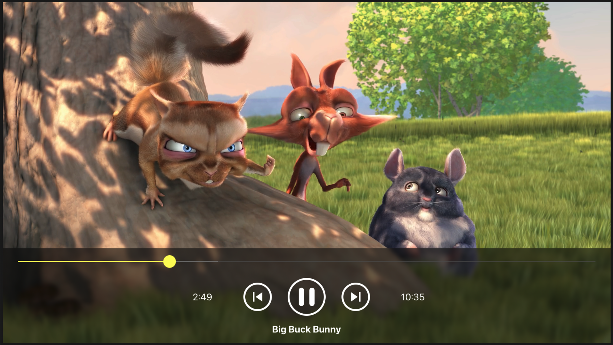

# React Native tvOS VideoPlayerDemo 

While learning React and RN, this is a demo video player I managed to cobble togther. 

It has a controls component which contains playback controls and a progress bar with focusable slider which works nicely with an Apple TV remote control. (Both types)

No idea if I'm doing this right yet. But it all seems to work fine! 

- Built using EXPO and https://github.com/react-native-tvos/react-native-tvos

---------
## NOTE: react-native-tvos FIX

- For this app to workm you will need to patch `node_modules/react-native/types/public/ReactNativeTVTypes.d.ts` until it gets patched back home. 

Fixed an issue in the react-native tvos typings in `ReactNativeTVTypes`. 
https://github.com/react-native-tvos/react-native-tvos/blob/efc6306fa372a2368c2fb74faf9001db5e8da302/packages/react-native/types/public/ReactNativeTVTypes.d.ts#L57

`velocityx` & `velocityy` should be `velocityX` & `velocityY`

Reported to source repo discussions : https://github.com/react-native-tvos/react-native-tvos/discussions/720

---------

### Testing

Clone this repo and cd into it.. 

- `yarn install`
- `export EXPO_TV=1`
- `export NO_FLIPPER=1`
- `npx expo prebuild --clean`
- `yarn ios`

----------------

@kosso - 3 May, 2024